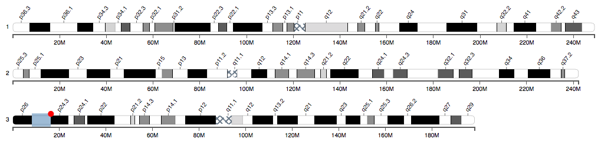

# cyto-chromosome-vis
[](http://badge.fury.io/js/cyto-chromosome-vis)
[](https://david-dm.org/linjoey/cyto-chromosome-vis)
[](https://david-dm.org/linjoey/cyto-chromosome-vis#info=devDependencies)
> Interactive visual representation/ web visualization tool for **chromosome** ideograms

This is a web component built with D3.js to render chromosome representations in SVG. Each chromosome has interactive features such as clicking a band, picking a specific cyto-location (base pair), or removing a specific selection. A convenient API is included to integrate user actions on the chromosomes with other js components. 

This can be used in plain JavaScript (as a **global** namespace object), in ***Angular.js*** (as a directive or a service), or in CommonJS environments such as **Node.js**.

### Demo
A demo is available here: http://linjoey.github.io/cyto-chromosome-vis/


### Usage 
Install with npm: `npm install --save cyto-chromosome-vis`

Install with bower: `bower install --save cyto-chromosome-vis`

Use in plain JavaScript, Angular, or Node.js

#### Plain JavaScript
- Include D3 and the project source: `cyto-chromosome.js` or `cyto-chromosome.min.js` from the project root.

- Create a target div to host the chromosome
```html
<div id="chrY"></div>
```

- Instantiate a chromosome object.
```javascript
var chromosomeFactory = cyto_chr.chromosome;
var x = chromosomeFactory()
        .segment("X")
        .target('#chrX')
        .render();
```

#### CommonJS
```html
<div id="test"></div>
<script src="bundle.js"></script>
```

```JavaScript
/*src.js*/
var chromosomeFactory = require('../cyto-chromosome-vis').chromosome;
chromosomeFactory()
  .target('#test')
  .render();
```

Here bundle.js is compiled with [Browserify](http://browserify.org/), e.g. `browserify src.js > bundle.js`


#### Angular.js
- Include the module `cyto-chromosome-vis` as a project dependency
```javascript
angular.module('demoApp',['cyto-chromosome-vis'])
```

- Simply use the directive `cytochromosome`
```html
<cytochromosome segment="X" width="1000" show-axis="true" use-relative="true" resolution="400"></cytochromosome>
```

- If you require interacting with the chromosome instance from a controller, inject the service `cytochromosome` and instantiate manually:

```html
<div id="chr3"></div>
```
```JavaScript
var app = angular.module('demoApp',['cyto-chromosome-vis'])
        .config(['cytochromosomeProvider', function(cytochr) {
            cytochr.setDataDir('data/');
        }])

        .controller('main', function($scope, cytochromosome) {

            var c = cytochromosome.build()
                    .target("#chr3")
                    .segment(3)
                    .showAxis(true)
                    .render();


        })

```

If the data directory is moved from the default `node_modules/cyto-chromosome-vis/data/`, inject `cytochromosomeProvider` and configure the data path relative to the html page. 

Once a chromosome is drawn, `click` a band to add a selector, `alt/option click` to add multiple selectors. Drag the edges of the selector to change the selection; click the red button on a selector to delete it.

### Configurations API

Configure chromosomes with `chromosome.config(type, value)` or `chromosome.type(value)`. `chromosome.type()` (no arguments) will return the current configuration. The default values for each configuration is shown below.

```javascript
var s = cyto_chr.chromosome()
    .config('segment', "2")
    .config('target', '#chrX') 
    .config('resolution', "850") //400, 550, or 850
    .config('width', 1200)
    .config('useRelative', false)
    .config('showAxis', false)
    .render();
    
s.resolution(); //850
s.width(); //1200
```

**chromosome.segment([string])** 
The chromosome number to draw, e.g. `"1" or "X"`
**Default**: 1

**chromosome.target([string])** 
id of a div to append the chromosome svg. Specify as string, e.g "#that-div" or a d3 selection
**Default**: the root html document

**chromosome.resolution([number])**
g-band resolutions
**Default**: 550

**chromosome.height([number])**
Height of the chromosome to draw. This is not the total svg height rendered.
**Default**: 17

**chromosome.width([number])**
Total width on the page to render
**Default**: parent's width

**chromosome.useRelative([bool])**
Render each chromosome relative to their real sizes. Setting this to `false` will draw the chromosome to the full `width`.
**Default**: true

**chromosome.showAxis([bool])** 
Display the basepair axis below the chromosome
**Default**: false

**chromosome.selectionMode([string])**
Allow single or multiple selectors on each chromosome. 'multi' or 'single'. To add additional selectors, press and hold the alt/option key while clicking a new band.
**Default**: 'single'


### API

**cyto_chr.chromosome()**
Create a new chromosome instance

**chromosome.render()**
A call to `render()` will update the svg with the current configurations. If something is changed later, call to `render()` again to re-draw the chromosome.

**chromosome.getSelections()**
Get an list of all the selections on the chromosome

**chromosome.newSelector(start, stop)**
Create a new selector on the start and stop basepair of the chromosome

**chromosome.moveSelectorTo(start, stop)**
Move the first selector to the start and stop basepair of the chromosome

**chromosome.getSVGTarget()**
Get the current DOM SVG. This is a d3 selection.

**chromosome.on(event, callback)**
Capture events from user interactions.
Events emmited are: `bandclick`, `selectorchange`, `selectorend`, and `selectordelete`.

```javascript
chromosome.on('bandclick', function(e) {
    //e contains contextual data
})
```

If the data directory is changed relative to the source, updated it with:
```javascript
cyto_chr.modelLoader.setDataDir('../data/');
```

### Date source: 
Data is loaded from static files in the `data/` directory. G-banding resolutions included are `400`, `550`, and `850`.

ftp://ftp.ncbi.nlm.nih.gov/pub/gdp/

# License
Apache License 2.0